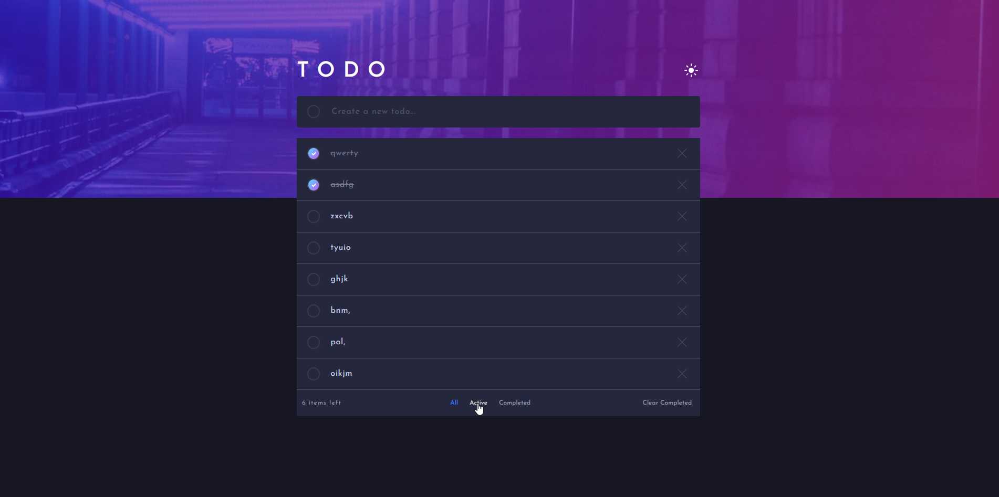

# Frontend Mentor - Todo App

This is a solution to the [Challenge Hub Todo App](https://www.frontendmentor.io/challenges/todo-app-Su1_KokOW/hub).
Frontend Mentor challenges help you improve your coding skills by building realistic projects.

## Table of contents

-   [Frontend Mentor - Todo App](#frontend-mentor---todo-app)
    -   [Table of contents](#table-of-contents)
    -   [Overview](#overview)
        -   [The challenge](#the-challenge)
        -   [Solution Link](#solution-link)
        -   [Screenshots](#screenshots)
        -   [Built with](#built-with)
    -   [Author](#author)

## Overview

### The challenge

Users should be able to:

-   View the optimal layout for the app depending on their device's screen size
-   See hover states for all interactive elements on the page
-   Add new todos to the list
-   Mark todos as complete
-   Delete todos from the list
-   Filter by all/active/complete todos
-   Clear all completed todos
-   Toggle light and dark mode
-   **Bonus**: Drag and drop to reorder items on the list
    -   The drag and drop feature was developed without relying on external libraries, as it appeared to offer a more straightforward solution.

### Solution Link

-   [Solution URL](https://frontend-mentor-todo-app-hub.vercel.app/)

### Screenshots

    
    

### Built with

-   [Typescript](https://www.typescriptlang.org/)
-   [Sass](https://sass-lang.com/)
-   [React](https://reactjs.org/)

## Author

Franco Moraes

 [GitHub](https://github.com/francomoraes)  
 [LinkedIn](https://www.linkedin.com/in/francomoraes/)
